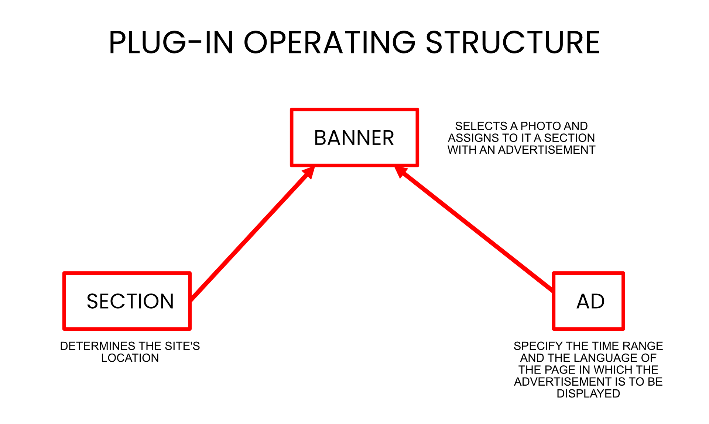
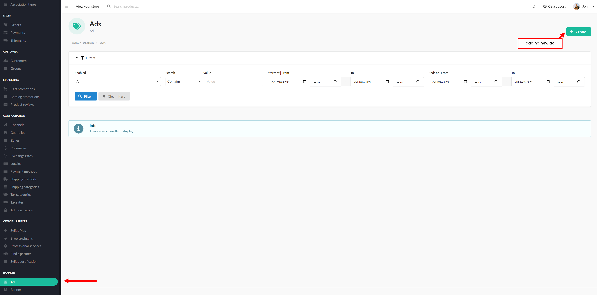
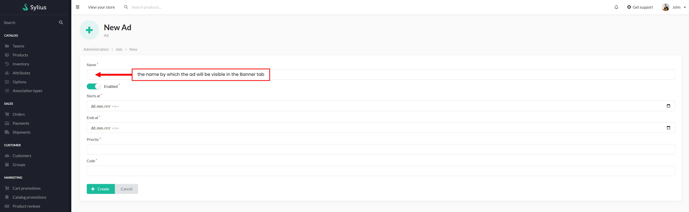
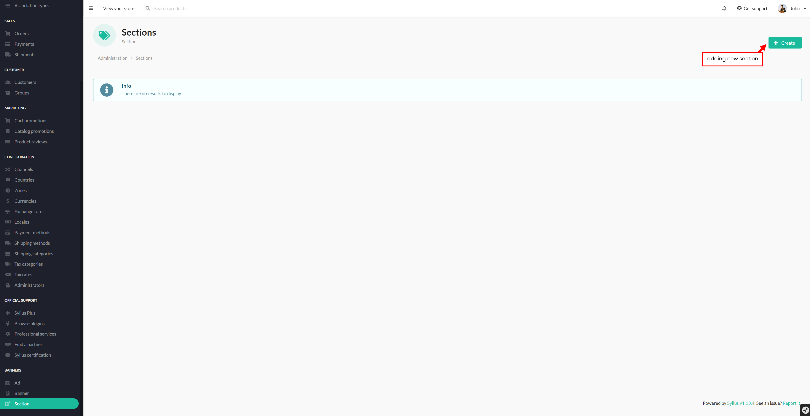
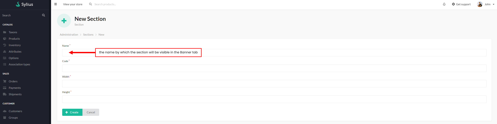
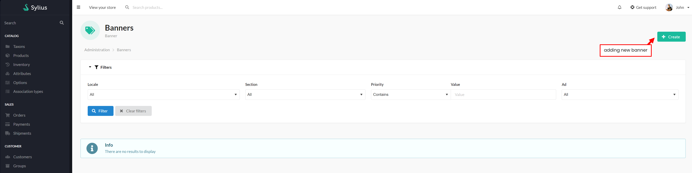
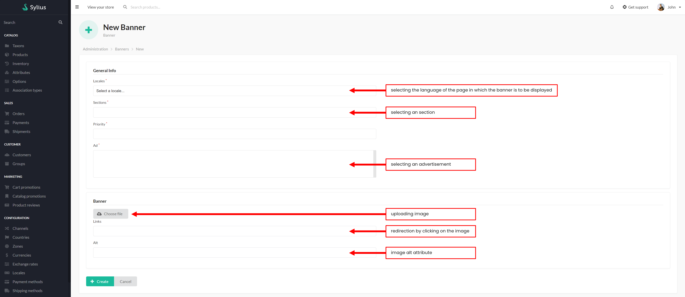

# Functionalities

---
## Introduction

---

Plugin allows you to manage banners on your shop. You can create time limited Ad and add to it banners with specific sections and locale.
Thanks that you can plan your marketing action a few moths forwards and don't worry about nothing

## Usage
The plugin allows you to display and change the way images are displayed on the website from the administrator level.

It consists of three elements:

- a section,
- an advertisement,
- a banner.

<div align="center">
    
</div>
<br>

#### SECTION
The section identifies the potential location of the image.
It is the section code that is placed in the twig files where the image is to appear.

Example of placing sections in twig files:

For example in layout.html.twig
````php
// templates/bundles/SyliusShopBundle/layout.html.twig
...
<div class="ui container">
    
        <header>
            {{ sylius_template_event('sylius.shop.layout.header') }}
        </header>
    
    // adding line below
    
    // -----------------------------------------------------
    

    {{ sylius_template_event('sylius.shop.layout.before_content') }}

    
    

    {{ sylius_template_event('sylius.shop.layout.after_content') }}
</div>
...
````
````php
// templates/bundles/SyliusShopBundle/Homepage/_banner.html.twig

    <div class="banners">
        
            <a href="{{banner.link}}">
                
            </a>
        
    </div>
````
...where "TEST-SECTION" is a SECTION CODE.

#### ADVERTISEMENT
The ad specifies the time and language in which the image is displayed

#### BANNER
Here, a image is added along with a link, and the predefined section and ad are selected.

---
### Display and addition of advertisements
#### Display ads
<div align="center">
    
</div>
<br>

#### Adding new ad
<div align="center">
    
</div>
<br>

---
### Display and addition of sections
#### Display sections
<div align="center">
    
</div>
<br>

#### Adding new section
<div align="center">
    
</div>
<br>

---
### Display and addition of banners
#### Display banners
<div align="center">
    
</div>
<br>

#### Adding new banner
<div align="center">
    
</div>
<br>
